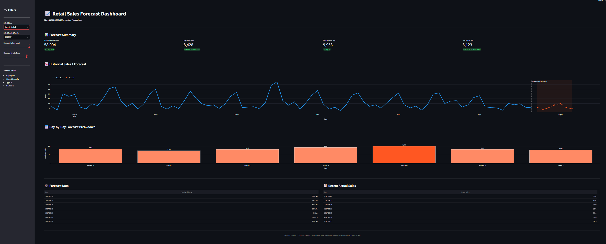
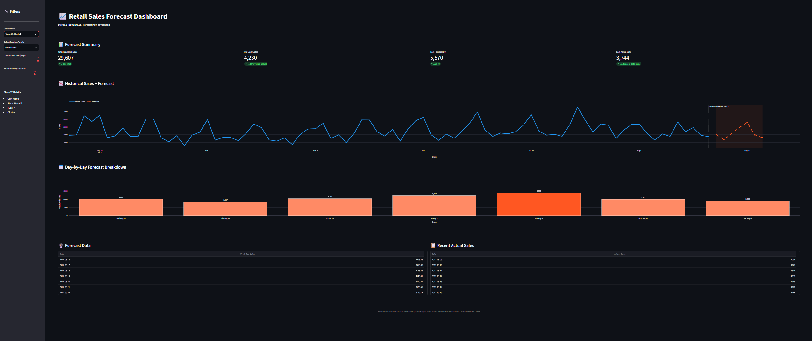

# End-to-End Retail Sales Forecasting Pipeline

A full data science pipeline that ingests raw retail sales data, transforms it
through a warehouse layer, trains a forecasting model, exposes predictions via
a REST API, and visualizes results in an interactive dashboard.



---

## Architecture

```
Raw CSVs → DuckDB Warehouse → dbt Transformations → XGBoost Model
                                                          ↓
                                          FastAPI REST Endpoint (/predict)
                                                          ↓
                                          Streamlit Interactive Dashboard
```

---

## Tech Stack

| Layer          | Tool                  |
|----------------|-----------------------|
| Storage        | DuckDB                |
| Transformation | dbt Core              |
| Modeling       | Prophet, XGBoost      |
| API            | FastAPI + Uvicorn     |
| Dashboard      | Streamlit + Plotly    |
| Language       | Python 3.10           |

---

## Dataset

[Kaggle Store Sales - Time Series Forecasting](https://www.kaggle.com/competitions/store-sales-time-series-forecasting)

Favorita grocery stores in Ecuador. 54 stores, 33 product families,
daily sales from 2013 to 2017. The dataset includes:

- `train.csv` — daily sales by store and product family
- `stores.csv` — store metadata (type, city, cluster)
- `oil.csv` — daily crude oil prices
- `holidays_events.csv` — national and regional holidays
- `transactions.csv` — daily customer transaction counts

---

## Model Performance

| Model    | RMSLE  | Scope                             |
|----------|--------|-----------------------------------|
| Prophet  | 0.1508 | Store 1, Grocery I (single series)|
| XGBoost  | 0.5468 | All 54 stores, 33 families        |

Kaggle leaderboard top score: ~0.376

---

## Project Structure

```
sales_forecast_project/
│
├── notebooks/
│   ├── 01_eda.ipynb               # Exploratory data analysis
│   ├── 02_load_to_duckdb.ipynb    # Raw CSV ingestion into DuckDB
│   ├── 03_verify_dbt.ipynb        # dbt output verification
│   ├── 04_modeling.ipynb          # Prophet + XGBoost training
│   └── 05_test_api.ipynb          # API endpoint testing
│
├── dbt_project/
│   ├── models/
│   │   ├── staging/
│   │   │   ├── sources.yml
│   │   │   ├── stg_train.sql
│   │   │   ├── stg_stores.sql
│   │   │   ├── stg_oil.sql        # Includes forward fill for missing prices
│   │   │   ├── stg_holidays.sql
│   │   │   └── stg_transactions.sql
│   │   └── marts/
│   │       └── mart_sales_features.sql  # Final joined feature table
│   └── dbt_project.yml
│
├── api/
│   └── main.py                    # FastAPI prediction endpoint
│
├── dashboard/
│   └── app.py                     # Streamlit dashboard
│
├── screenshots/
│   ├── dashboard_grocery.png
│   └── dashboard_beverages.png
│
├── .gitignore
├── requirements.txt
└── README.md
```

---

## How to Run

### 1. Clone the repo
```bash
git clone https://github.com/OrkoDutta/sales-forecast-pipeline.git
cd sales-forecast-pipeline
```

### 2. Set up environment
```bash
conda create -n sales_forecast python=3.10
conda activate sales_forecast
pip install -r requirements.txt
```

### 3. Download the data
Download from [Kaggle](https://www.kaggle.com/competitions/store-sales-time-series-forecasting/data)
and place all CSV files in `data/raw/`

### 4. Run the notebooks in order
```
notebooks/01_eda.ipynb
notebooks/02_load_to_duckdb.ipynb
notebooks/03_verify_dbt.ipynb
notebooks/04_modeling.ipynb
```

### 5. Run dbt transformations
```bash
cd dbt_project
dbt run
```

### 6. Start the API
```bash
cd api
uvicorn main:app --reload
```
API docs available at: `http://127.0.0.1:8000/docs`

### 7. Launch the dashboard
Open a second terminal:
```bash
cd dashboard
streamlit run app.py
```
Dashboard available at: `http://localhost:8501`

---

## API Usage

### Single Prediction
```bash
POST http://127.0.0.1:8000/predict

{
  "store_nbr": 44,
  "family": "GROCERY I",
  "date": "2017-08-16",
  "onpromotion": 5,
  "oil_price": 48.5,
  "is_national_holiday": 0,
  "transactions": 2500.0,
  "sales_lag_7": 8000.0,
  "sales_lag_14": 7800.0,
  "sales_lag_28": 7600.0,
  "sales_rolling_7day_avg": 7900.0,
  "sales_rolling_28day_avg": 7700.0
}
```

### Response
```json
{
  "store_nbr": 44,
  "family": "GROCERY I",
  "date": "2017-08-16",
  "store_type": "A",
  "predicted_sales": 8734.25
}
```

### Batch Prediction
```bash
POST http://127.0.0.1:8000/predict/batch

{
  "predictions": [
    { ...request1... },
    { ...request2... }
  ]
}
```

---

## Key Engineering Decisions

**Oil price forward fill** — Oil prices are missing on weekends and holidays.
Rather than dropping rows or using a global mean, the dbt model generates a
full date spine and carries the last known price forward. This preserves
temporal accuracy.

**Lag features** — Sales from 7, 14, and 28 days ago are the strongest
predictors in time series forecasting. These are computed in dbt using window
functions partitioned by store and product family.

**Rolling averages** — 7-day and 28-day smoothed sales reduce noise and help
the model learn trend direction alongside point values.

**Early stopping** — XGBoost is trained with `early_stopping_rounds=50` to
halt training when the validation score stops improving, preventing overfitting.

**Transactions as NaN** — Zero-valued transaction records (missing data filled
with 0 in dbt) are replaced with NaN before training so XGBoost treats them
as missing rather than genuine zero-traffic days.

**Date-based train/test split** — Data is split by date (train: 2013–June 2017,
test: July–August 2017), never randomly shuffled, to prevent future data leaking
into the training set.

---

## Screenshots

### GROCERY I — Store 44 (Quito, Type A)


### BEVERAGES — Store 52 (Manta, Type A)


---

## Further Improvements

- Train separate models per store or product family for higher accuracy
- Log-transform the sales target to further reduce RMSLE
- Add hyperparameter tuning with Optuna or GridSearchCV
- Dockerize the API and dashboard for one-command deployment
- Add automated retraining pipeline when new data arrives

---

## Author

**Orko Dutta**
- Email: oorkodutta@gmail.com
- GitHub: [github.com/OrkoDutta](https://github.com/Orko-Dutta-13)

---

## License

MIT License — free to use and modify.
